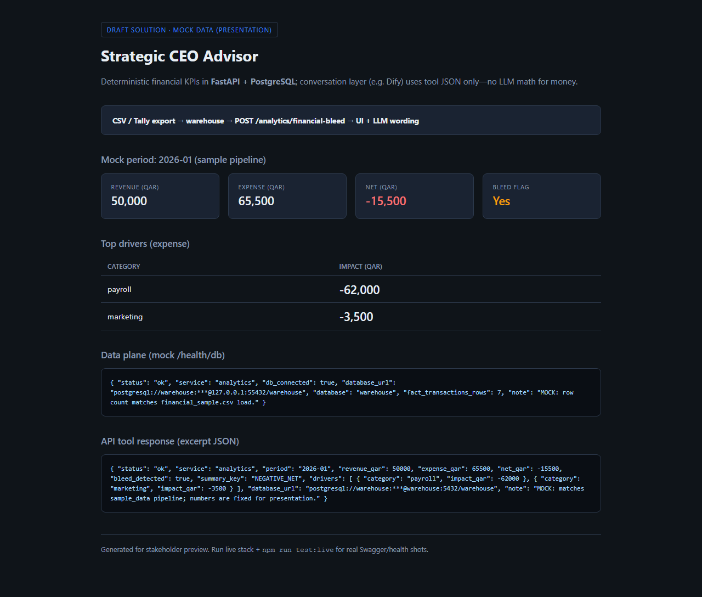
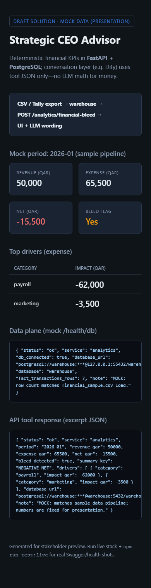
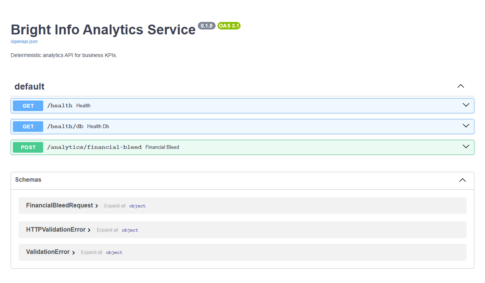
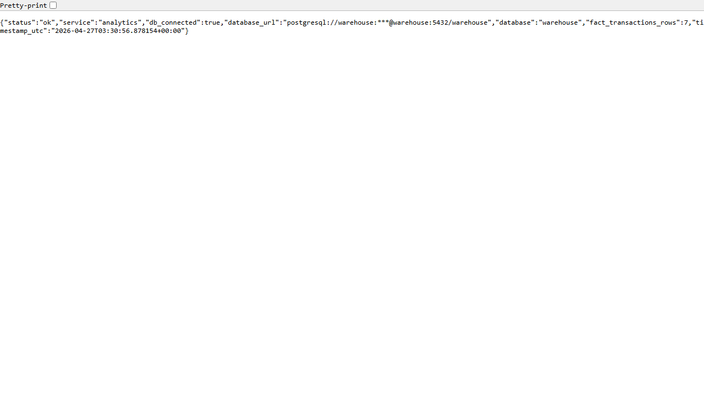
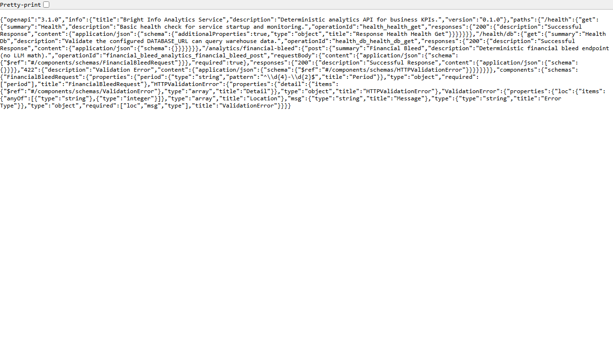
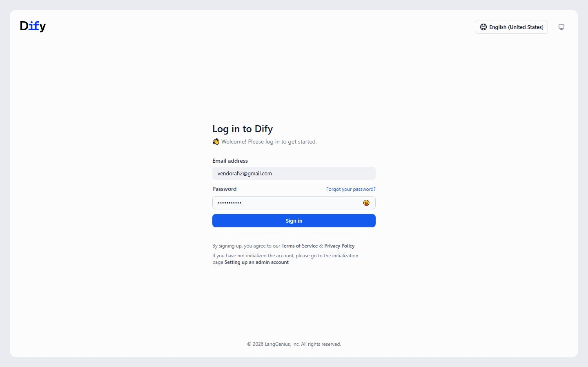
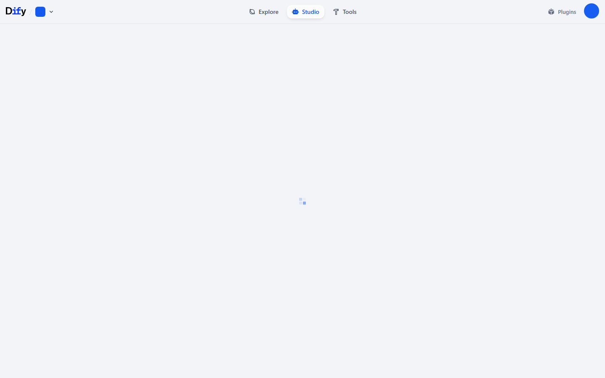
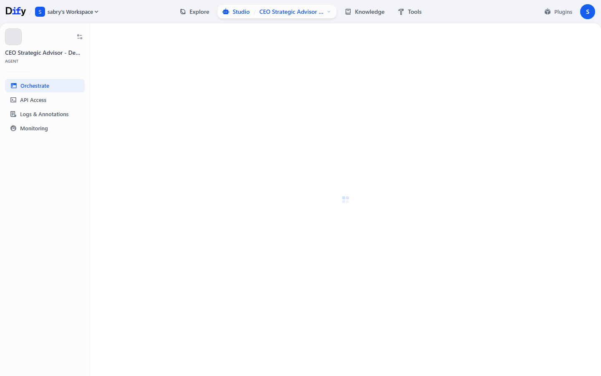
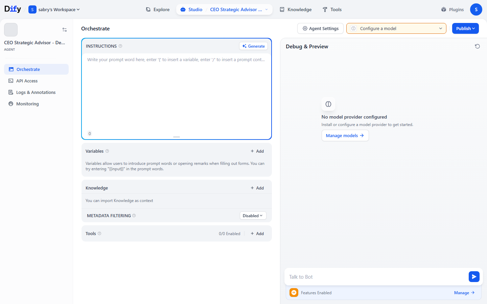

# Bright Info — AI Strategic Advisor (NexSolve RFQ workspace)

Runnable prototype and presentation assets for a **CEO-facing strategic advisor**: warehouse data in **PostgreSQL**, KPIs via **FastAPI**, optional **Ollama** LLM and **Dify** orchestration—numbers come from the API/tool JSON, not LLM guesses.

---

## Demo scenario & use cases

**Context:** A pilot loads finance rows from CSV into a private Postgres warehouse; leadership asks questions in **English or Arabic**. Full narrative, sample questions, and expected JSON are in **`planning/presentation/full-demo-scenario.md`**.

| # | Use case | Question (examples) | What we prove |
|---|-----------|---------------------|----------------|
| **1** | January financial bleed | “Did we bleed money in **January 2026**?” / «هل كان تراجع مالي في يناير 2026؟» | Net **−15,500 QAR**, bleed **true**; top cost drivers from deterministic **`POST /analytics/financial-bleed`** (`period: 2026-01`). |
| **2** | February recovery vs January | “How did February compare to January?” | February net **+18,000 QAR**, bleed **false**—same endpoint, **`period: 2026-02`**. |
| **3** | Data connectivity & completeness | “Is pilot data loaded?” | **`GET /health/db`** → DB connected; **7** rows in sample load (`fact_transactions_rows`). |

Mock API payloads for slides and NotebookLM: **`planning/presentation/mock-api/`** (`uc1-*`, `uc2-*`, `uc3-*`).

---

## Playwright screenshots (evidence)

Captured by **`planning/demos/draft-solution-demo`** ([Playwright README](planning/demos/draft-solution-demo/README.md)). Paths below are from the repo root (GitHub renders these images on the repo home page).

### Mock storyboard (draft presentation)

| Desktop | Mobile |
|:-------:|:------:|
|  |  |

### Live API (stack smoke)

| Swagger `/docs` | `/health/db` | `/openapi.json` |
|:---:|:---:|:---:|
|  |  |  |

### Dify workflow (sign-in → app → run)

| Sign-in | Apps home | Agent open | Workflow run |
|:---:|:---:|:---:|:---:|
|  |  |  |  |

**Regenerate:** from `planning/demos/draft-solution-demo`, run `npm test` / `npx playwright test` per that folder’s README (live tests skip if services are down).

---

## Repository layout

| Folder | Purpose |
|--------|---------|
| **`solution/`** | Runnable prototype: warehouse Docker, **FastAPI analytics**, tests, Dify integration notes, pilot reverse-proxy examples |
| **`planning/`** | Delivery plans, runbooks, RFQ templates, demos — see **`planning/README.md`** |

**Master checklist:** `planning/solution-build-master-steps.md`

### Other quick links

- **Speaker outline:** `planning/presentation/speaker-outline.md`
- **Internal demo & stack:** `planning/pilot-ops/internal-demo-runbook.md`
- **RFQ strategy:** `planning/rfq-strategy/ai-strategic-advisor-rfq-delivery-plan.md`
- **Phase C (EOI → acceptance) templates:** `planning/phase-c/README.md`
- **NotebookLM demo script:** `planning/demos/draft-solution-demo/screenshots/dify-workflow/notebooklm-demo-script.md`
- **Playwright evidence note:** `planning/evidence/dify-workflow-playwright-report.md`
