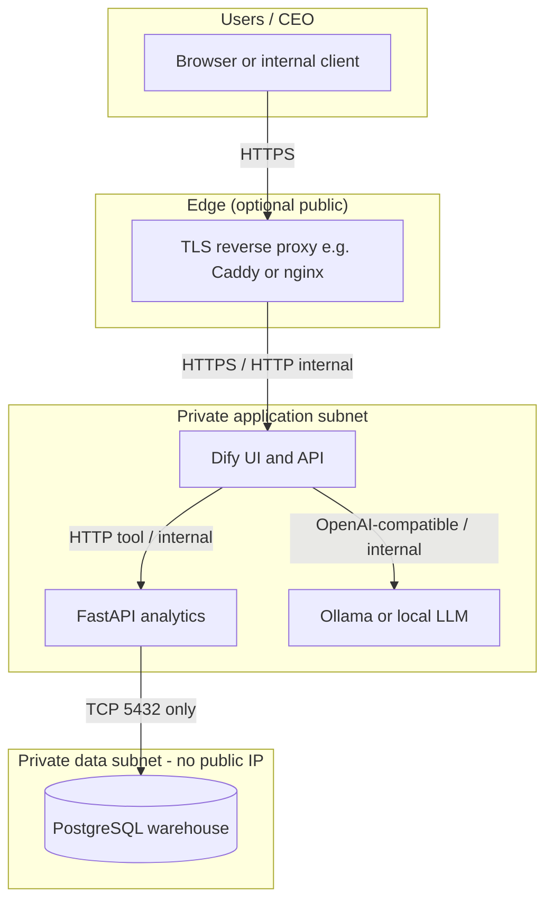
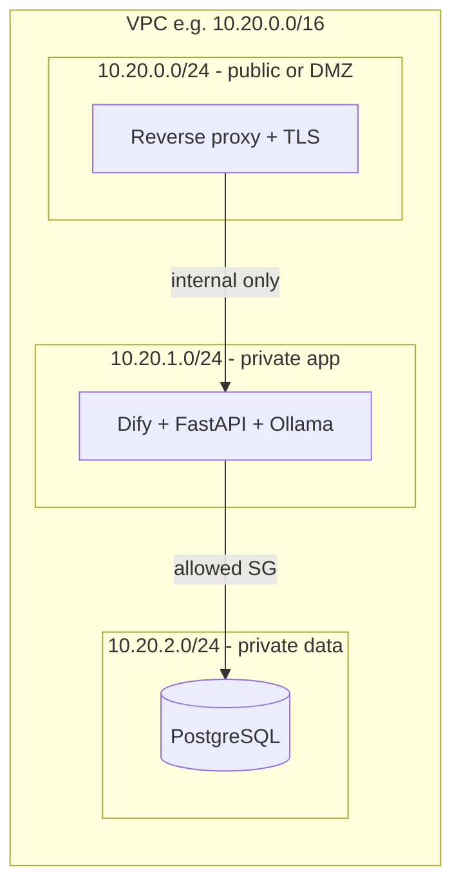

# Pilot network architecture (Step 16)

**Purpose:** Target deployment for a self-hosted CEO advisor stack: private subnets, no public database, clear trust boundaries. Aligns with RFQ expectations (dedicated VPC, data not exposed to the public internet).

**Scope:** Pilot / 60-day — same pattern extends to production with stricter hardening (WAF, SIEM, key management).

## Design goals

| Goal | How |
|------|-----|
| Database never reachable from the internet | PostgreSQL in **private** subnets only; SG/firewall allow **analytics → DB:5432** only |
| App tier reachable only via controlled entry | **Reverse proxy (TLS)** on public or private-with-VPN; Dify + FastAPI behind it |
| LLM traffic contained | Ollama (or equivalent) on private network; no inbound from internet to model port |
| Operator access | SSM / bastion / VPN — not ad-hoc public SSH to data tier |

## Reference cloud-agnostic layout

Use one VPC (or resource group + VNet) split into **three** zones:

1. **Public / edge** — Internet-facing (optional) **only** for reverse proxy and TLS termination. Many pilots use **client VPN** or **private link** so even Dify is not on a public IP.
2. **Application** — Dify, FastAPI analytics, Ollama (if self-hosted in same project).
3. **Data** — PostgreSQL warehouse only. **No public IP**; `5432` allowed from application security group / subnet ACL only.

## Diagram (logical)

## Diagram (subnets — example CIDRs)

*Adjust CIDRs to client policy. In a fully private pilot, the “public” subnet may only hold a load balancer in front of a VPN or be omitted.*

## Port and flow summary

| From | To | Port | Protocol | Notes |
|------|-----|------|----------|--------|
| Internet / VPN users | TLS proxy | 443 | HTTPS | Terminate TLS here |
| TLS proxy | Dify | 80/3000/etc. | HTTP internal | As per Dify install |
| Dify (tool) | FastAPI on host or container | 18001 or internal | HTTP | `host.docker.internal:18001` (Windows) or `http://analytics:8001` (same network) |
| Dify (model) | Ollama | 11434 | HTTP | LLM; keep private |
| FastAPI | PostgreSQL | 5432 | TCP | **Only** from app to DB subnet |

**Critical:** `postgres` is **not** listed in the “from Internet” row.

## Hardening checklist (pilot)

- [ ] Database subnet: **deny** `0.0.0.0/0` on port 5432.
- [ ] Use distinct credentials: DB user for FastAPI; separate Dify DB if upstream requires it (isolation in same VPC).
- [ ] Store secrets in parameter store or env-injected at deploy — not in Git (see `solution/.env.example` pattern).
- [ ] When client specifies Qatar / PDPPL: document **data residency** choice (e.g. region) and who operates backups.

## Related files

- TLS + proxy examples: `solution/pilot/reverse-proxy/README.md`
- RBAC design: `pilot-rbac-design.md` (same folder)
- Backups: `postgres-backup-restore-runbook.md` (same folder)
